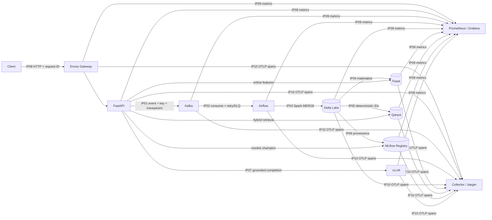

# Architecture and ownership — Lab 28 Track 2

Sơ đồ trực quan chính: [lab28-architecture-overview.png](images/lab28-architecture-overview.png).

## Luồng kiến trúc

## Năm lớp và trách nhiệm

| Lớp | Thành phần | Trách nhiệm |
|---|---|---|
| Client/edge | Client, Envoy | Route, request ID, rate limit, health route |
| Serving/compute | FastAPI, vLLM | Orchestration, guardrail, degraded policy, generation |
| Data | Kafka, Airflow, Spark, Delta | Durable event flow, retry/DLQ, dedupe, transactional storage |
| ML/retrieval | Feast, Qdrant, MLflow | Online features, grounded retrieval, release provenance |
| Operations | Prometheus, Grafana, OTEL, Jaeger | Golden signals, alerting và trace continuity |

## Ownership của 10 integration point

| IP | Boundary | Owner | Contract/Invariant chính |
|---|---|---|---|
| IP01 | HTTP ingestion → Kafka | Ingestion & Orchestration | `IngestionEvent`; Kafka key là `idempotency_key`; giữ traceparent |
| IP02 | Kafka → Airflow | Ingestion & Orchestration | Consume, retry, DLQ và Airflow asset/run ID |
| IP03 | Airflow/Spark → Delta | Data & ML | Một source row/key; MERGE; version và time travel |
| IP04 | Delta → Feast | Data & ML | Entity `asker_id`; feature view `asker_activity_v1`; freshness |
| IP05 | Delta → Qdrant | Serving & Retrieval | Deterministic UUID; dense+sparse hybrid retrieval |
| IP06 | Evaluation → MLflow | Data & ML | Signature, tags, git SHA, Delta version và champion alias |
| IP07 | RAG prompt → vLLM | Serving & Retrieval | vLLM thật; đúng model ID; latency/token metrics |
| IP08 | Client → Envoy | Platform & Observability | Route, `x-request-id`, rate limit 429 và health routing |
| IP09 | Components → Prometheus/Grafana | Platform & Observability | Targets, golden signals và actionable SLO alert |
| IP10 | Components → OTLP/Jaeger | Platform & Observability | Một trace ID chứa đủ required spans |

Nếu làm cá nhân, một người chịu trách nhiệm toàn bộ các owner trên. Ownership ở
đây phân tách miền chẩn đoán và trách nhiệm vận hành, không có nghĩa một người chỉ
cần hiểu một đoạn của happy path.

## Cách chẩn đoán theo boundary

1. Dùng trace ID để xác định span cuối cùng còn thành công.
2. Kiểm tra health/readiness của dependency ở boundary kế tiếp.
3. Đối chiếu contract và identity: topic/key, entity/features, collection/model ID.
4. Kiểm tra durable state trước khi retry: Kafka offset/DLQ, Delta version, Qdrant
   point count hoặc MLflow alias.
5. Chỉ recovery sau khi đã ghi state trước sự cố; xác minh lại bằng cùng ID.

